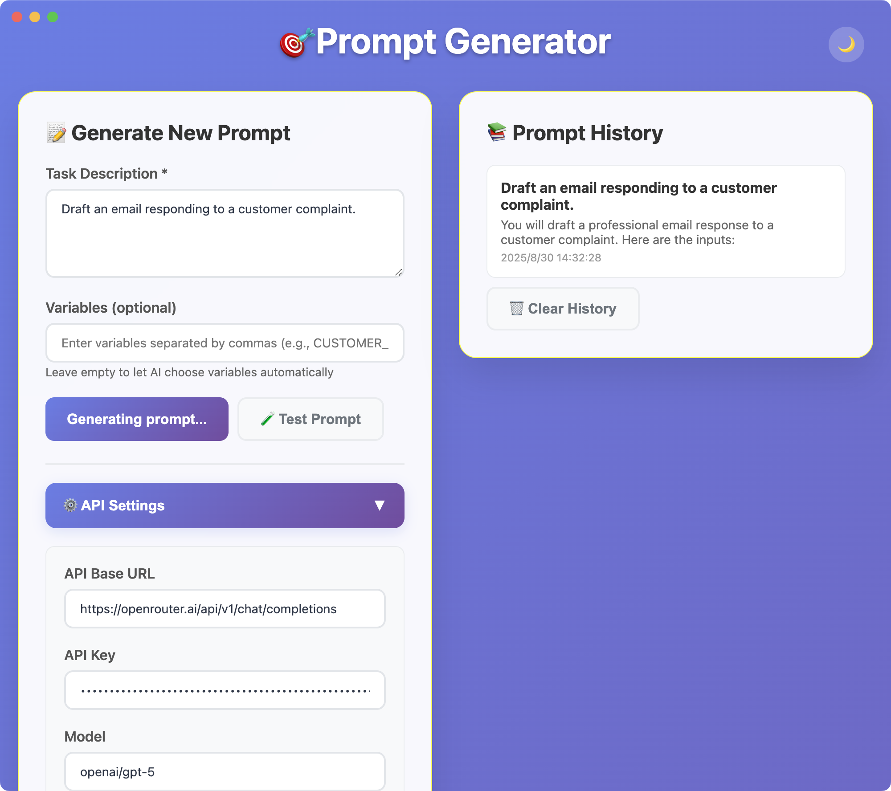
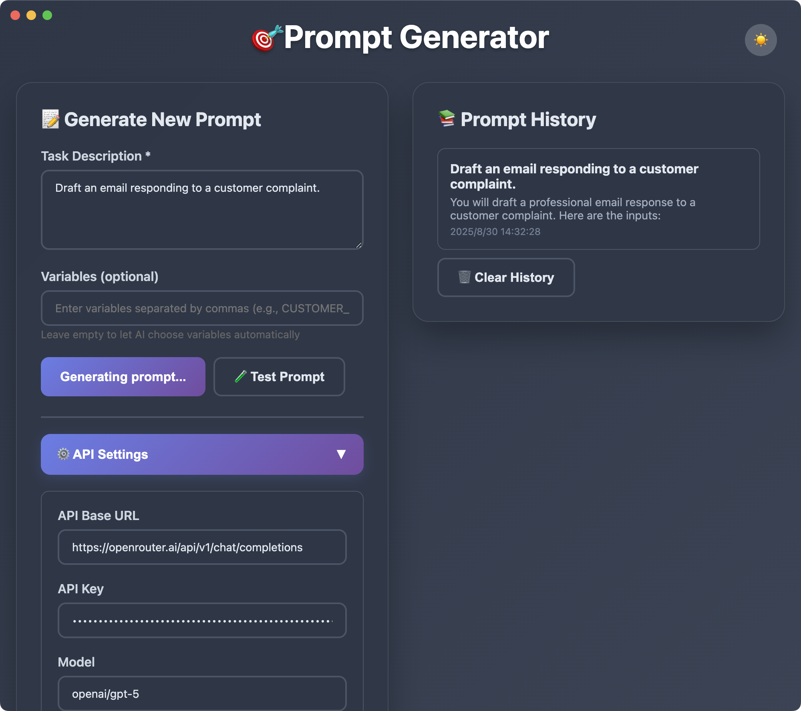

# Prompt Generator

A local desktop application for generating effective AI prompts using meta-prompting techniques.

## Features

🎯 **Prompt Generation**: Uses the Anthropic metaprompt to generate high-quality prompts for various tasks

🔧 **Flexible API Support**: Supports OpenAI-compatible APIs with customizable base URLs

💾 **Local Storage**: Saves API settings and prompt history locally

<p align="center">
  <table>
    <tr>
      <td align="center">
        <br/>
        <sub>Light</sub>
      </td>
      <td align="center">
        <br/>
        <sub>Dark</sub>
      </td>
    </tr>
  </table>
</p>

## Usage

1. **First Time Setup**:
   - Click "⚙️ API Settings"
   - Enter your API key
   - Optionally change the API base URL or model
   - Click "💾 Save Settings"

2. **Generate Prompts**:
   - Enter your task description in the text area
   - Optionally specify variables (comma-separated)
   - Click "🚀 Generate Prompt"

3. **Test Prompts**:
   - After generating a prompt, click "🧪 Test Prompt"
   - The app will automatically generate test inputs and show results

4. **View History**:
   - Use the right panel to browse previous prompts
   - Click any history item to load it back

```
prompt-generator/
├── src/
│   ├── main.js          # Electron main process
│   ├── preload.js       # Secure preload script
│   ├── index.html       # Main interface
│   └── app.js           # UI logic and API calls
├── package.json         # Dependencies and scripts
└── README.md           # This file
```

## API Configuration

The app is compatible with any OpenAI-compatible API endpoint. Examples:

- OpenAI: `https://api.openai.com/v1/chat/completions`
- Azure OpenAI: `https://your-resource.openai.azure.com/openai/deployments/your-deployment/chat/completions?api-version=2023-05-15`
